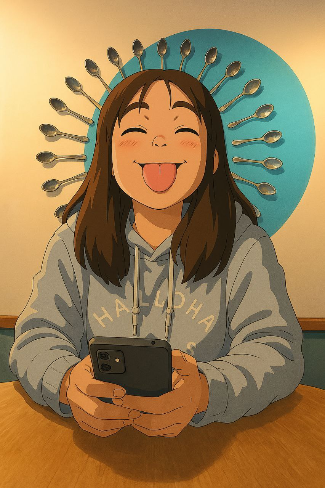

<!DOCTYPE html>
<html lang="es">
<head>
    <meta charset="UTF-8">
    <meta name="viewport" content="width=device-width, initial-scale=1.0">
    <title>S.I.A. | AGENTE SANTOS</title>
    <link href="https://fonts.googleapis.com/css2?family=Bebas+Neue&display=swap" rel="stylesheet">
    
</head>
<body>

    

        <h1>S.I.A. ARCHIVE</h1>
        
RESTRICCIÓN DE NIVEL 7

        <input type="text" id="u" placeholder="INVESTIGADORA">
        <input type="password" id="p" placeholder="CLAVE (DD.MM.AAAA)">
        <button onclick="auth()" class="accept-btn" style="font-size: 1.5rem; width: 100%;">VALIDAR CREDENCIALES</button>
    

    
TOP SECRET

    
    <header>
        
REGISTRO DE INTELIGENCIA AMOROSA // REF_0-8

        <h1>DOSSIER SANTOS</h1>
    </header>

    <nav>
        <button class="nav-tab active" onclick="tab(event, 'p1')">PERFIL AGENTE</button>
        <button class="nav-tab" onclick="tab(event, 'p2')">HISTORIAL DE MISIONES</button>
        <button class="nav-tab" onclick="tab(event, 'p3')">ULTIMA MISION</button>
        <button class="nav-tab" onclick="tab(event, 'p4')">NUEVA MISIÓN</button>
    </nav>

    <section id="p1" class="section active">
        

            

                
            

            

                <h2>ILSEN MILENKA SANTOS VILLCA</h2>
                
<b>APODOS:</b> ILS, MI AMOR, CORAZÓN, PILSEN

                
<b>NACIMIENTO:</b> 25/07/2004

                
<b>RESIDENCIA:</b> LA PAZ - ORURO - COCHABAMBA

                
<b>HIMNO:</b> MI SUERTE - MORAT

                
<b>FLOR:</b> TULIPÁN (ROSADO)

                
<b>DEBILIDAD:</b> HELADO

                

                    * NOTA DEL ASISTENTE M: LA AGENTE PRESENTA UNA RESISTENCIA NULA ANTE EL HELADO Y UNA AFINIDAD CRÍTICA HACIA LOS TULIPANES.
                

            

        

    </section>

    <section id="p2" class="section">
        

            
            

                <h3>MISIÓN: CHIMUELO</h3>
                

                    
<video src="Chimuelo_1.mp4" loop muted onmouseover="this.play()" onmouseout="this.pause()"></video>

                    
                

            

            

                <h3>MISIÓN: CUMPLEAÑOS</h3>
                

                    
<video src="Cumple_1.mp4" loop muted onmouseover="this.play()" onmouseout="this.pause()"></video>

                    
                

            

            

                <h3>MISIÓN: PIPIRIPI</h3>
                

                    
<video src="Pipiripi_1.mp4" loop muted onmouseover="this.play()" onmouseout="this.pause()"></video>

                    
                

            

            

                <h3>MISIÓN: IMPOSICIÓN DE BATA</h3>
                

            

            

                <h3>MISIÓN: STITCH</h3>
                

            

            

                <h3>MISIÓN: PIZZA</h3>
                

            

            

                <h3>MISIÓN: MANQA (ORIGEN)</h3>
                

                    

                    

                

            

        

    </section>

    <section id="p3" class="section">
        

            <h2 style="font-family: var(--font-title); font-size: 3rem; color: var(--red-stamp);">REPORTE TYPICA // 18-02</h2>
            

                A LAS <strong>17:30 HORAS</strong>, LAS COORDENADAS SE ALINEARON EN EL CAFÉ TYPICA.   
                FUE UN ENCUENTRO QUE DESAFÍO EL CALENDARIO ESTÁNDAR; MIENTRAS EL MUNDO CELEBRABA EL 14, NOSOTRAS CONSTRUIMOS NUESTRO PROPIO TIEMPO EL 18.   
                LA ATMÓSFERA SE TORNÓ <strong>MÁGICA</strong>. ENTRE EL AROMA A CAFÉ Y LAS MIRADAS COMPLICES, LO BONITO NO FUE EL LUGAR, SINO LA CERTEZA DE ESTAR AHÍ.   
                <strong>ESTADO DEL REPORTE:</strong> MEMORIA INBORRABLE. ÉXITO ABSOLUTO.
            

        

    </section>

    <section id="p4" class="section">
        

            <h1 style="color: var(--red-stamp);">ASIGNACIÓN: CASO 0-8</h1>
            

                
<strong>CLASIFICACIÓN:</strong> CONFIDENCIAL 

                
<strong>APERTURA:</strong> 08/01/2024

                
<strong>ESTADO:</strong> ACTIVO

                
<strong>INVESTIGADORA:</strong> ILSEN SANTOS

                
<strong>ASISTENTE:</strong> AGENTE M

            

            

                ESTE CASO NO BUSCA CULPABLES, BUSCA REVELACIONES. EL PORTAFOLIO ESTÁ LISTO PARA SU ENTREGA FINAL.
            

            <button class="accept-btn" onclick="openModal()">ACEPTAR MISIÓN</button>
        

    </section>

    

        <h2>MISIÓN CONFIRMADA</h2>
        
>>> ACCESO CONCEDIDO

        
LA REUNIÓN HA SIDO AGENDADA EXITOSAMENTE.

        

            
FECHA: 19/02/2026

            
HORA: 13:30

            
AGENTE DE CONTACTO: M

            
LUGAR: CANCILLERÍA

        

        
>>> LAS HERRAMIENTAS DE INVESTIGACIÓN LA ESPERAN, DETECTIVE SANTOS.

        <button onclick="closeModal()" style="background: #00ff00; color: #000; border: none; padding: 10px 20px; font-family: monospace; font-weight: bold; cursor: pointer;">CERRAR TERMINAL</button>
    

    RADIO_SIA: 
    <select onchange="playM(this)" style="background:none; color:white; border:none; font-family:'Bebas Neue';">
        <option value="idiota.mp3">MORAT - IDIOTA</option>
        <option value="la_correcta.mp3">MORAT - LA CORRECTA</option>
    </select>
    <audio id="ap"></audio>

</body>
</html>
